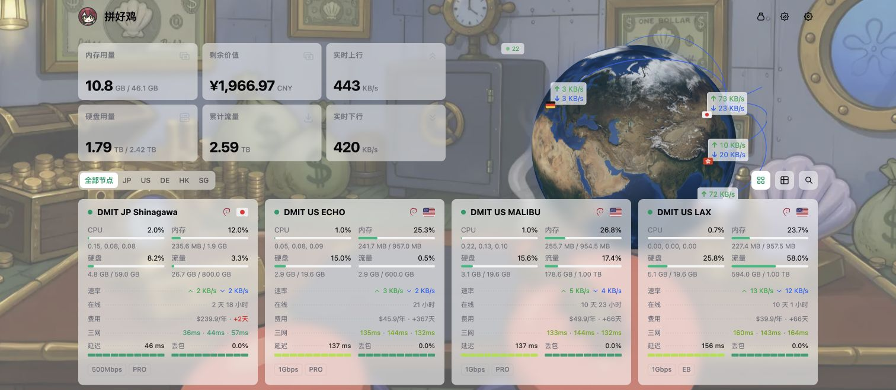

<h1 align="center">Komari Emerald Globe</h1>

<p align="center">面向 Komari Monitor 的 Emerald 二次开发主题，为原版交互地球加入自然彩色纹理，同时保留节点连线、实时速率与完整监控体验。</p>



## 功能特性

- 彩色昼夜地球：基于 Three.js 与 Globe.gl，随亮色/暗色模式切换地球纹理。
- 节点网络可视化：保留地区标记、国家/地区间连接线与实时上下行速率。
- 多种首页展示：支持旋转地球、静止地球、点状地图、卡片以及列表模式。
- 完整节点监控：提供资源概览、节点卡片、详情页、负载与延迟图表。
- 个人价值计算：右上角钱袋入口始终可见，可自行选择计入统计的服务器，默认全选。
- 公开数据互不影响：个人价值选择不会修改首页面向所有访客的剩余价值统计。
- 本地偏好保存：个人选择与显示币种只保存在当前浏览器中。
- 响应式与性能优化：适配桌面和移动设备，页面不可见时暂停地球渲染。

## 安装

### 通过仓库链接导入（推荐）

在 Komari 后台进入 `设置 -> 主题管理 -> 导入主题 -> 导入远程主题`，粘贴以下仓库地址：

```text
https://github.com/allen0039/komari-theme-emerald-globe
```

Komari 会读取该仓库的最新 GitHub Release 并安装其中的主题包。远程导入后，主题管理会继续以本仓库 Release 作为更新来源；发布新版本时，按后台的更新提示操作即可。

### 通过 ZIP 导入

1. 打开 [Releases](https://github.com/allen0039/komari-theme-emerald-globe/releases) 并下载最新版 `komari-theme-emerald-globe-build-*.zip`。
2. 在 Komari 后台进入 `设置 -> 主题管理`，选择上传/导入本地主题。
3. 选择下载的 ZIP 文件，安装完成后刷新页面。

## 兼容性

- 已验证 Komari `1.3.2` 与 `1.4.3`。
- 推荐使用支持 WebGL 的现代浏览器，以获得完整地球效果。
- 其他 Komari 版本可能也可运行，但尚未逐一验证。

## 隐私与外部请求

- 本主题没有加入统计分析或用户追踪代码，也不会保存 Komari 登录凭据。
- 个人价值工具仅在浏览器 `localStorage` 中保存未计入节点的 UUID 与所选币种，不会写入 Komari 后端，也不会改变公开统计。
- 为换算金额，浏览器会按日向 `api.frankfurter.app` 请求汇率，失败时回退到 `open.er-api.com`；请求失败则使用缓存或内置参考值。
- Iconify 图标、世界地图数据以及启用的访客信息卡会分别请求公共 CDN/API。和任何浏览器网络请求一样，服务提供方会收到请求所必需的网络信息；访客信息卡可在主题设置中关闭。

## 本地开发

环境要求：Node.js `^20.19.0` 或 `>=22.12.0`，Bun `>=1.2.0`。

```bash
bun install
bun run dev
bun run type-check
bun run lint
bun run build
```

构建完成后会生成 `komari-theme-emerald-globe-build-*.zip`，其中包含主题清单、预览图和前端产物。

## 技术栈

Vue 3、Vite 7、Tailwind CSS 4、Pinia、ECharts、Three.js、Globe.gl、reka-ui。

## 致谢

- [Komari](https://github.com/komari-monitor/komari)
- [Komari Emerald](https://github.com/Tokinx/komari-theme-emerald)：本主题的直接上游项目
- [Komari Glassmorphism](https://github.com/sanrokamlan-prog/komari-theme-Glassmorphism)：彩色地球实现与纹理参考
- [Komari Naive](https://github.com/lyimoexiao/komari-theme-naive)：Emerald 的主题基座

## 许可证

本项目采用 [MIT License](LICENSE)。
