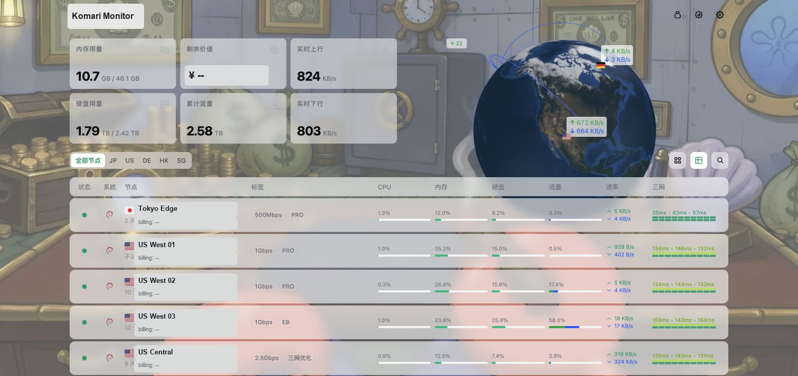
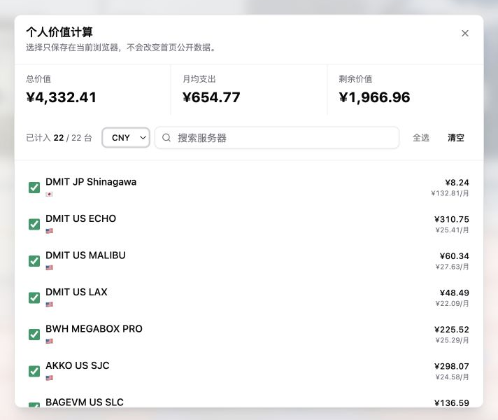
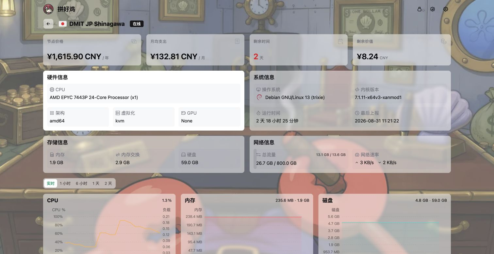
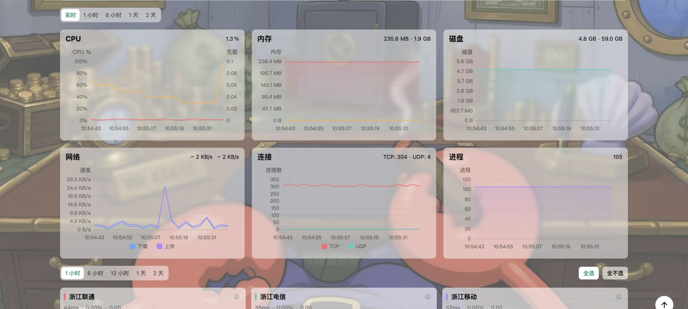
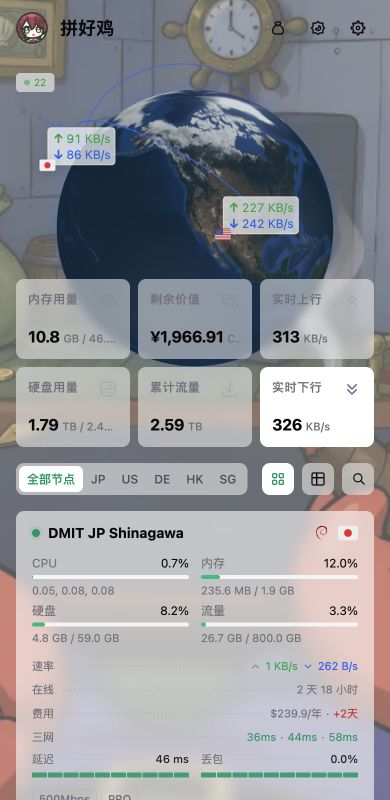

<h1 align="center">Komari Emerald Globe</h1>

<p align="center">面向 Komari Monitor 的 Emerald 普通版二次开发主题：彩色交互地球、节点连线、实时速率与紧凑的监控卡片。</p>

<p align="center">
  <a href="https://github.com/allen0039/komari-theme-emerald-globe/releases"></a>
  <a href="https://github.com/allen0039/komari-theme-emerald-globe/blob/main/LICENSE"></a>
  <a href="https://github.com/komari-monitor/komari"></a>
</p>


## 项目定位

本仓库是 `Komari Emerald Globe` 普通版主题，基于 [Komari Emerald](https://github.com/Tokinx/komari-theme-emerald) 二次开发，重点保留原主题的轻量监控体验，并加入彩色地球、网络连线和更完整的节点信息展示。

本仓库只包含普通版主题代码，不包含其他版本仓库中的 Pro 功能或专属配置。主题不修改 Komari 后端数据，也不会改变节点上报方式。

## 功能

### 彩色交互地球

- 亮色和暗色模式使用对应的地球纹理。
- 显示节点所在地区、国家标记和节点之间的连接线。
- 地球标记支持实时上下行传输速率展示。
- 支持自转地球、静止地球、点状地图、仅显示汇总卡片和隐藏头部等模式。
- 页面不可见时会暂停地球渲染，减少不必要的浏览器资源消耗。

### 首页汇总与节点卡片

- 汇总内存、硬盘、累计流量、实时上行和实时下行。
- 节点卡片展示在线状态、操作系统、地区、CPU、内存、硬盘、流量、速率、在线时长、费用和自定义标签。
- 支持卡片视图和列表视图，列表可按状态、系统、节点名、CPU、内存、硬盘、流量和速率排序。
- 支持节点名称、地区、系统、分组、标签和备注搜索。
- 支持将离线节点统一排到列表末尾。

### 三网延迟与丢包

- 卡片的“摘要”模式按固定顺序显示最多三组网络的延迟和丢包率，适合快速扫读。
- “明细”模式分别展示每组网络的延迟、丢包率和历史条形趋势。
- 延迟和丢包颜色会随指标状态变化，悬停可以查看网络名称、时间和具体数值。
- 点击延迟或丢包区域可打开节点图表，查看更长时间范围的数据。
- 可在主题设置中配置三网显示顺序；未配置时沿用后端任务顺序并自动补足最多三项。

### 节点详情与图表

- 节点详情页集中展示硬件、系统、存储、网络和费用信息。
- 负载图表支持实时数据及按时间范围查看历史 CPU、内存、磁盘、网络、连接数和进程数据。
- 延迟图表支持多任务对比，并可分别查看延迟与丢包趋势。
- 图表会根据 Komari 后端实际保留的数据范围提供可用时间选项。

### 个人价值计算

- 顶部钱袋入口始终可见，访客无需登录即可看到入口。
- 可单独选择需要计入个人统计的服务器，默认全选。
- 支持全选、清空、搜索服务器和切换显示币种。
- 个人统计只影响钱袋面板，不会改变首页面向所有访客的公开剩余价值。
- 选择的服务器 UUID 和币种只保存在当前浏览器的 `localStorage` 中。

### 访客信息与隐私显示

- 底部访客信息卡默认只显示地区和浏览器。
- 点击访客信息卡后才展开设备、完整 IP、运营商和访问时间等详细信息。
- 访客信息卡可在主题设置中关闭。
- 主题不保存访客 IP，也不向 Komari 后端写入访客信息。

## 界面预览

### 首页与节点列表



### 个人价值计算



### 节点详情



### 性能与延迟图表



### 移动端

<p align="center">
  
</p>

预览图只用于展示界面结构。公开文档和示例图不应包含服务器 IP、IPv6、管理地址、访问凭据、API 密钥或其他私有标识；节点名称和监控数值属于截图时的示例数据，使用者部署时会自动替换为自己的数据。

## 安装

### 远程仓库导入（推荐）

1. 打开 Komari 后台的 `设置 -> 主题管理`。
2. 选择 `导入主题 -> 导入远程主题`。
3. 粘贴普通版仓库地址：

   ```text
   https://github.com/allen0039/komari-theme-emerald-globe
   ```

Komari 会读取仓库的最新 GitHub Release 并安装主题包。远程导入后，后续版本可以继续通过主题管理中的更新提示获取。

### ZIP 文件导入

1. 前往 [Releases](https://github.com/allen0039/komari-theme-emerald-globe/releases)。
2. 下载最新版 `komari-theme-emerald-globe-build-*.zip`。
3. 在 Komari 后台的主题管理中上传 ZIP 并完成导入。
4. 导入后刷新页面；如果浏览器仍显示旧资源，可执行一次强制刷新。

## 主题设置

主题清单 `komari-theme.json` 提供以下可管理配置：

| 配置 | 说明 |
| --- | --- |
| 数据更新间隔 | 设置实时数据刷新间隔，建议 1-10 秒。 |
| RPC 连接模式 | 在 WebSocket 与 HTTP 之间选择，默认使用 WebSocket。 |
| 默认视图模式 | 设置首页默认使用卡片或列表视图。 |
| 公告设置 | 控制首页公告及其标题、内容。 |
| 头部展示模式 | 选择自转地球、静止地球、点状地图、汇总卡片或隐藏头部。 |
| 访客信息卡片 | 开关底部访客信息卡。 |
| 隐藏后台入口 | 控制未登录访客是否看到后台入口。 |
| 减弱过渡动画 | 减少页面切换和数据更新动画。 |
| 延迟节点排序 | 按名称配置三网任务显示顺序，多个名称用英文逗号分隔。 |
| 离线节点后置 | 开启后将离线节点排到节点列表末尾。 |
| 备案设置 | 可选显示 ICP 备案和公安备案信息。 |
| 自定义背景 | 可选使用图片或视频背景，并设置模糊和遮罩强度。 |

首页工具栏中的“摘要 / 明细”、卡片视图、列表视图和搜索状态属于当前浏览器的界面偏好，不会写入 Komari 后端。

## 隐私与外部请求

- 仓库不包含探针 IP、部署域名、管理地址、登录凭据、Token、API 密钥或其他部署机密。
- 个人价值计算只在浏览器本地保存排除节点 UUID 和显示币种，不会修改公开统计或写入后端。
- 汇率数据按需请求 `api.frankfurter.app`，失败时回退到 `open.er-api.com`，并使用缓存或内置参考值兜底。
- 图标按需请求 Iconify CDN，点状世界地图可能从 jsDelivr、Fastly、Gcore 或 GitHub Raw 获取地图数据。
- 开启访客信息卡时，浏览器会从公共地理信息服务获取访客地区、运营商和 IP；当前实现按顺序尝试 `api.ip.sb`、`ipwho.is`、`api.ipapi.is`、`ipapi.co` 和 `api.vore.top`，请求失败会自动尝试下一个服务。
- 访客 IP 默认不显示，只有用户主动点击底部访客信息卡后才会显示完整 IP。若不希望发起此类请求，可在主题设置中关闭访客信息卡。
- 主题没有统计分析代码、广告脚本或用户追踪代码。

使用公共 CDN/API 时，服务提供方可能获得完成请求所必需的网络信息。请根据自己的隐私要求决定是否启用相应功能。

## 兼容性

- 主题面向支持 Komari 公开 RPC/指标接口的版本。
- 项目当前按 Komari `1.3.x` 和 `1.4.x` 进行适配；不同后端版本可用的图表指标和数据保留范围可能不同。
- 推荐使用支持 WebGL 的现代浏览器，以获得完整的地球和地图效果。
- 如果服务器禁用 WebSocket，可在主题设置中切换为 HTTP RPC；具体可用性取决于 Komari 后端配置。

## 本地开发

环境要求：Node.js `^20.19.0` 或 `>=22.12.0`，Bun `>=1.2.0`。

```bash
bun install
bun run dev
bun run type-check
bun run lint
bun run build
```

`bun run build` 会执行类型检查、生产构建，并生成可导入 Komari 的：

```text
komari-theme-emerald-globe-build-<git-hash>.zip
```

ZIP 包包含编译后的 `dist/`、主题清单 `komari-theme.json` 和发布预览图 `preview.png`。

## 技术栈

Vue 3、Vite 7、Tailwind CSS 4、Pinia、ECharts、Three.js、Globe.gl、reka-ui。

## 致谢

- [Komari Monitor](https://github.com/komari-monitor/komari)
- [Komari Emerald](https://github.com/Tokinx/komari-theme-emerald)：直接上游项目
- [Komari Glassmorphism](https://github.com/sanrokamlan-prog/komari-theme-Glassmorphism)：彩色地球与纹理实现参考
- [Komari Naive](https://github.com/lyimoexiao/komari-theme-naive)：Emerald 主题基座参考

## 许可证

本项目采用 [MIT License](LICENSE)。上游项目和第三方资源请同时遵守其各自许可证及使用条款。
